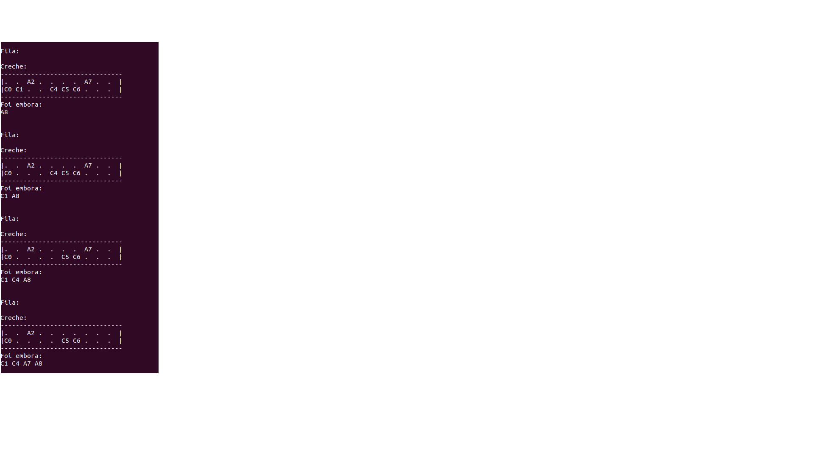

# Projeto Multithread MC504
Projeto com o objetivo de implementar uma aplicação multithread que utiliza semáforos e/ou mutex locks e variáveis de condição para sincronização e de um visualizador para o progresso da aplicação. Foi utilizado o problema child care do livro [The Little Book of Semaphores](https://greenteapress.com/semaphores/LittleBookOfSemaphores.pdf) de Allen B. Downey.

## Responsável pela implementação do problema
- Luiz Henrique Yuji Delgado Oda - RA 247255

## Descrição do problema

O problema trata do funcionamento de uma creche onde temos dois tipos de atores, crianças e adultos. As crianças e adultos vão até a creche e depois vão embora, mas a todo mmomento deve existir pelo menos um adulto para cada três crianças dentro da creche. Crianças que não podem entrar na creche devem esperar.

## Especificações do código

Para executar o código precisamos das bibliotecas unistd.h, stdlib.h, stdio.h, semaphore.h e pthread.h. Para compilar o código devemos inserir a flag -pthread. Depois disso, basta rodar o executável. Importante ressaltar que o código foi testado apenas em um sistema Linux, utilizando a linha de compilação gcc creche.c -o creche -pthread. É possível mudar a quantidade de pessoas mudando o valor de N_PESSOAS. Pode ocorrer do programa muitas vezes não conseguir rodar todas as threads. Isso é uma consequência natural do problema, já que algumas vezes crianças não conseguem entrar na creche devido a falta de adultos, seja por eles não existirem ou por já terem ido embora.

## Vídeo e slides
[Vídeo explicando o problema](https://drive.google.com/file/d/1_tCDtSC09f6I0GQRBAa34DB1MyUnMtWG/view?usp=sharing)

[Slides utilizados no vídeo](https://www.canva.com/design/DAFjlthgY3g/taYSL7OXTLs0XMOf2-1RhA/edit?utm_content=DAFjlthgY3g&utm_campaign=designshare&utm_medium=link2&utm_source=sharebutton)

## Visualização

Ao rodar o executável há a impressão do estado da aplicação em diversos instantes, mostrando as crianças na fila para entrar na creche, as pessoas dentro da creche e aqueles que entraram na creche e foram embora, conforme a imagem abaixo. Foi utilizada a impressão de caracteres ASCII para essa implementação.

## Referências 
Allen B. Downey. The Little Book of Semaphores. Green Tea Press, 2008.
